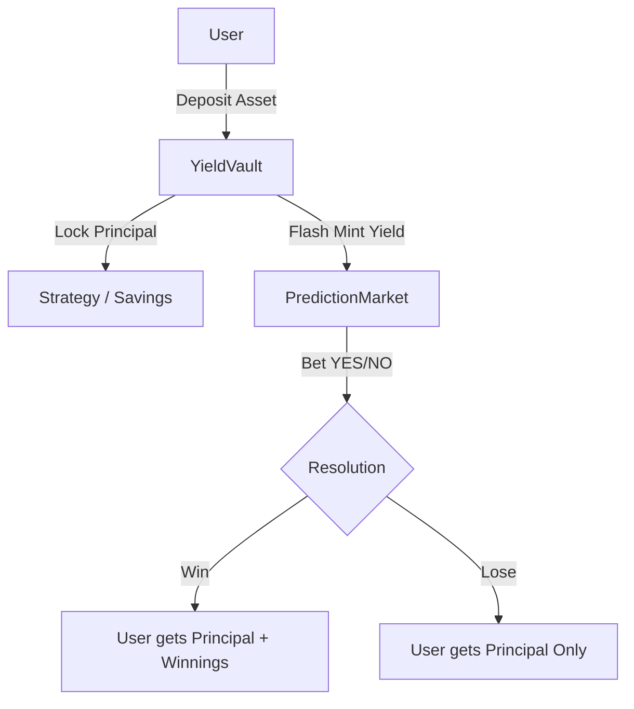

# YieldEdge: The First “Zero-Loss” Prediction Market on Mantle

---

## 💡 The Problem

Prediction markets are exciting, but **capital inefficiency** and **risk of loss** keep most users away.
1.  **High Risk**: You can lose your entire principal if you bet wrong.
2.  **Opportunity Cost**: Locking capital in a betting market means missing out on DeFi yields.
3.  **Slow Feedback**: You have to wait for yield to accrue naturally before you can play "risk-free".

## 🚀 The Solution: YieldEdge

**YieldEdge** is a lossless prediction market powered by **Flash Yield**. We allow users to "time-travel" their future yield to place bets *instantly*, without ever risking their principal.

### ✨ Key Features

*   **⚡ Flash Yield (Instant Power)**: Don't wait for interest to accrue. We advance your future yield instantly (via Flash Loan logic) so you can start betting 10 seconds after depositing.
*   **🛡️ Zero-Loss Betting**: Your principal is 100% protected in the underlying vault. You only bet with the yield. If you lose, you get your principal back. If you win, you take the yield from the losers.
*   **🤖 Strategy Vaults**: Specialized vaults (like the *BTC Bull Run Enhanced Vault*) that simplify the experience. Deposit once, and manage your "curated bets" from a single dashboard.
*   **💰 Double Asset Stack**: Full support for both **USDY** (stable yield) and **mETH** (staking yield) ecosystems.

---

## 📸 Screenshots

### The Higher State of Prediction Markets

*Experience the first zero-loss prediction market on Mantle with our new "Spiritual Healer" aesthetic.*

### Curated Strategy Vaults

*Deposit into specialized vaults like BTC Bull Run or Stable Yield to earn risk-free betting power.*

---

## 🏗️ Architecture

YieldEdge is built on a modular "Vault + Market" architecture.



*   **YieldVault**: The core bank. Manages deposits (USDY/mETH) and calculates "Flash Yield" limits.
*   **PredictionMarket**: A standalone contract for each betting topic ("BTC > 100k"). It holds *yield tokens* only, never principal.
*   **MarketFactory**: Deploys new markets and connects them to the authorized Vault.

---

## 📜 Deployed Contracts (Mantle Sepolia)

| Contract | Address |
| :--- | :--- |
| **USDY YieldVault** | `0x1676614C211795e3990Df2F4d7cc028C9B347ADF` |
| **MarketFactory** | `0xe4d8b0345e95604e98da4ba1d539407c58d02199` |
| **BTC > $100k Market** | `0xa188527c4a95f0a413d3cb91c48c3d7be8745aaa` |
| **ETH > $5k Market** | `0x208a4954a9f35f8be65a945b995a8670cbfe3ca4` |
| **Strategy Vault (BTC)** | `0xBaFeB777b7a100F3f4ea407b70344715b6059dFB` |

> *See [doc/DEPLOYMENT.md](./doc/DEPLOYMENT.md) for the full list of addresses.*

---

## 🛠️ Tech Stack

*   **Network**: Mantle Sepolia (Chain ID: 5003)
*   **Contracts**: Solidity 0.8.23, Foundry
*   **Frontend**: Next.js 14, TypeScript, Tailwind CSS
*   **Web3 Integration**: RainbowKit, Wagmi, Viem
*   **Data Visualization**: Recharts

## 🏃‍♂️ Quick Start

### 1. Install Dependencies
```bash
cd frontend
npm install
```

### 2. Run Locally
```bash
npm run dev
# Open http://localhost:3000
```

### 3. Run Tests (Contracts)
```bash
cd contracts
forge test
```

## 📄 License
MIT
